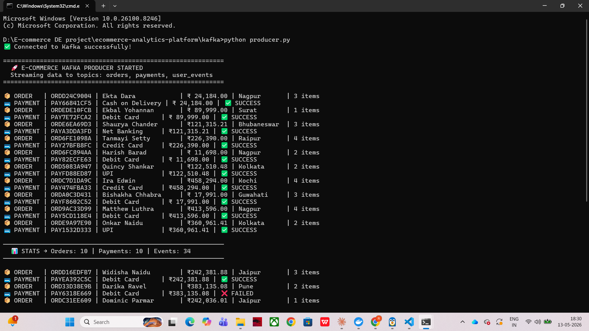
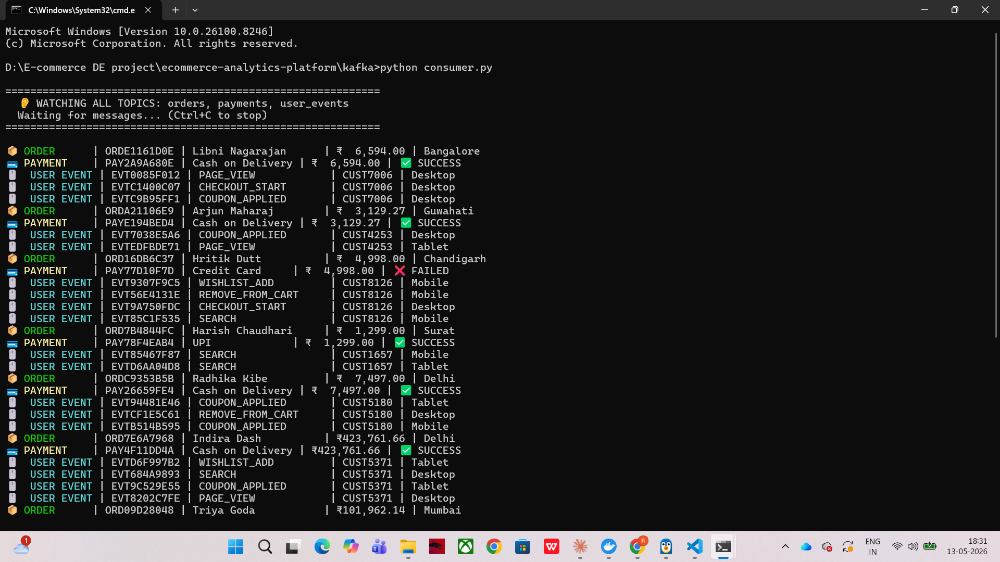
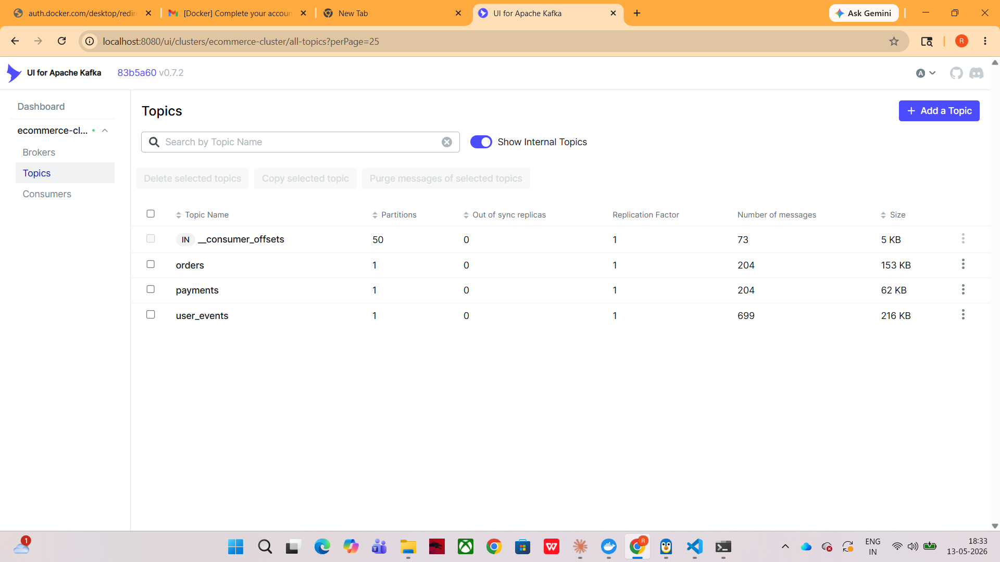

# 🛒 Real-Time E-Commerce Analytics Platform

A production-grade end-to-end data platform that combines **Data Engineering** 
and **Data Analytics** — built with the most in-demand Big Data tools of 2026.

---

## 🏗️ Architecture

---

## 📸 Screenshots

### Kafka Producer — Live Orders Streaming


### Kafka Consumer — Reading Messages in Real Time


### Kafka UI — Topics Dashboard


Kafka Producer (Python)
│
▼
Apache Kafka  ──────────────────────────────────────┐
(orders, payments, user_events topics)              │
│                                           │
▼                                           ▼
Apache Spark Structured Streaming            Kafka UI Dashboard
│                                    (localhost:8080)
▼
Delta Lake (Lakehouse — Raw + Curated layers)
│
▼
Apache Hive (SQL interface on Delta Lake)
│
▼
Apache Airflow (nightly batch aggregations)
│
▼
Analytics (PySpark — RFM, Churn, Trends)
│
▼
Power BI / Apache Superset Dashboard

---

## 🔧 Tech Stack

| Layer | Technology |
|---|---|
| Data Ingestion | Apache Kafka |
| Stream Processing | Apache Spark Structured Streaming |
| Storage | Delta Lake (Lakehouse Architecture) |
| Batch Querying | Apache Hive + Spark SQL |
| Orchestration | Apache Airflow |
| Analytics | PySpark, Python (Pandas, Matplotlib) |
| Visualisation | Power BI / Apache Superset |
| Infrastructure | Docker, Docker Compose |

---

## 📦 Project Phases

| Phase | Description | Status |
|---|---|---|
| Phase 1 | Kafka data ingestion — Producer & Consumer | ✅ Complete |
| Phase 2 | Spark Structured Streaming | 🔄 In Progress |
| Phase 3 | Delta Lake Lakehouse | ⏳ Upcoming |
| Phase 4 | Hive + Airflow batch pipeline | ⏳ Upcoming |
| Phase 5 | Analytics + Dashboard | ⏳ Upcoming |
| Phase 6 | Docker + Cloud deployment | ⏳ Upcoming |

---

## 🚀 How to Run Phase 1

### Prerequisites
- Docker Desktop installed and running
- Python 3.8+
- pip

### Step 1 — Start Kafka infrastructure
```bash
docker compose up -d
```

### Step 2 — Install Python dependencies
```bash
pip install kafka-python faker
```

### Step 3 — Start the Producer (Terminal 1)
```bash
cd kafka
python producer.py
```

### Step 4 — Start the Consumer (Terminal 2)
```bash
cd kafka
python consumer.py
```

### Step 5 — View Kafka UI
Open your browser at **http://localhost:8080**

---

## 📊 What the Producer Generates

- **Orders** — realistic Indian e-commerce orders with products, prices, cities
- **Payments** — UPI, Credit Card, Net Banking (90% success rate)
- **User Events** — page views, product clicks, add to cart, searches

---

## 👤 Author

**M Rakshith**  
Data Engineering Enthusiast  
[LinkedIn](https://linkedin.com/in/yourprofile) | [GitHub](https://github.com/yourusername)